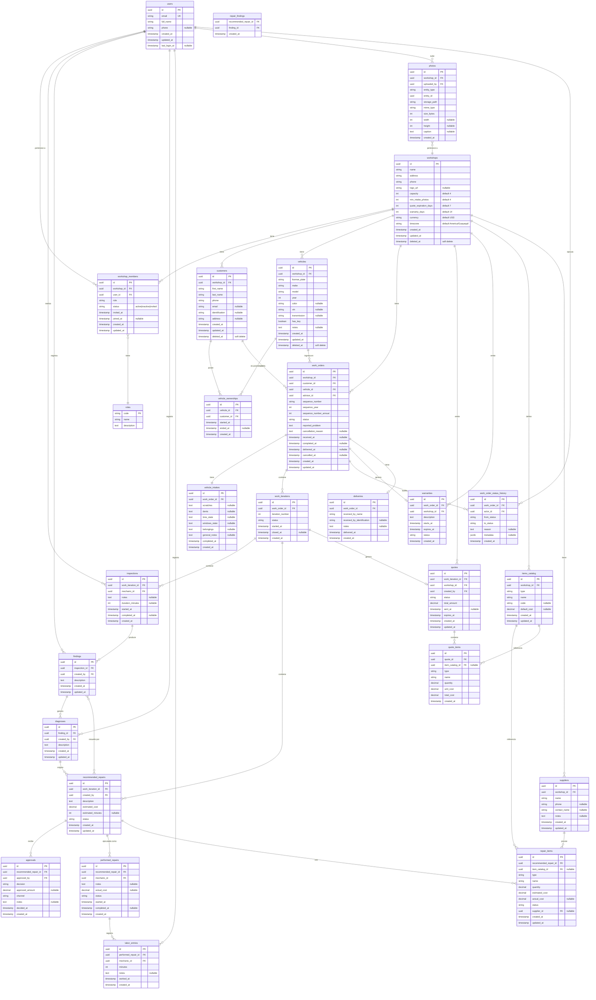

[← Índice del modelo conceptual](./README.md)

# Diagrama ERD

```mermaid
erDiagram
    workshops ||--o{ workshop_members : "tiene"
    workshops ||--o{ customers : "tiene"
    workshops ||--o{ vehicles : "tiene"
    workshops ||--o{ work_orders : "tiene"
    workshops ||--o{ quotes : "emite"
    workshops ||--o{ warranties : "emite"
    workshops ||--o{ items_catalog : "define"
    workshops ||--o{ suppliers : "tiene"

    users ||--o{ workshop_members : "pertenece a"
    users ||--o{ inspections : "realiza"
    users ||--o{ findings : "registra"
    users ||--o{ diagnoses : "registra"
    users ||--o{ labor_entries : "registra"
    users ||--o{ photos : "sube"
    users ||--o{ work_order_status_history : "ejecuta"

    workshop_members }o--|| roles : "tiene"

    customers ||--o{ vehicle_ownerships : "posee"
    vehicles ||--o{ vehicle_ownerships : "es poseido por"

    vehicles ||--o{ work_orders : "ingresa en"
    customers ||--o{ work_orders : "solicita"

    work_orders ||--|| vehicle_intakes : "tiene"
    work_orders ||--o{ work_iterations : "contiene"
    work_orders ||--o{ work_order_status_history : "audita"
    work_orders ||--o| warranties : "genera"
    work_orders ||--o| deliveries : "tiene"

    work_iterations ||--o{ inspections : "contiene"
    work_iterations ||--o{ recommended_repairs : "contiene"
    work_iterations ||--o| quotes : "genera"

    inspections ||--o{ findings : "produce"
    findings ||--o{ diagnoses : "genera"
    findings }o--o{ recommended_repairs : "resuelto por"

    diagnoses ||--o{ recommended_repairs : "origina"

    recommended_repairs ||--o{ approvals : "recibe"
    recommended_repairs ||--o{ performed_repairs : "ejecutada como"
    recommended_repairs ||--o{ repair_items : "usa"

    performed_repairs ||--o{ labor_entries : "registra"

    quotes ||--o{ quote_items : "contiene"

    items_catalog ||--o{ repair_items : "referencia"
    items_catalog ||--o{ quote_items : "referencia"

    suppliers ||--o{ repair_items : "provee"

    photos }o--|| workshops : "pertenece a"

    customers {
        uuid id PK
        uuid workshop_id FK
        string first_name
        string last_name
        string phone
        string email "nullable"
        string identification "nullable"
        string address "nullable"
        timestamp created_at
        timestamp updated_at
        timestamp deleted_at "soft delete"
    }

    vehicles {
        uuid id PK
        uuid workshop_id FK
        string license_plate
        string make
        string model
        int year
        string color "nullable"
        string vin "nullable"
        string transmission "nullable"
        boolean has_key
        text notes "nullable"
        timestamp created_at
        timestamp updated_at
        timestamp deleted_at "soft delete"
    }

    vehicle_ownerships {
        uuid id PK
        uuid vehicle_id FK
        uuid customer_id FK
        timestamp started_at
        timestamp ended_at "nullable"
        timestamp created_at
    }

    workshops {
        uuid id PK
        string name
        string address
        string phone
        string logo_url "nullable"
        int capacity "default 4"
        int min_intake_photos "default 4"
        int quote_expiration_days "default 7"
        int warranty_days "default 14"
        string currency "default USD"
        string timezone "default America/Guayaquil"
        timestamp created_at
        timestamp updated_at
        timestamp deleted_at "soft delete"
    }

    users {
        uuid id PK
        string email UK
        string full_name
        string phone "nullable"
        timestamp created_at
        timestamp updated_at
        timestamp last_login_at "nullable"
    }

    workshop_members {
        uuid id PK
        uuid workshop_id FK
        uuid user_id FK
        string role
        string status "active|inactive|invited"
        timestamp invited_at
        timestamp joined_at "nullable"
        timestamp created_at
        timestamp updated_at
    }

    work_orders {
        uuid id PK
        uuid workshop_id FK
        uuid customer_id FK
        uuid vehicle_id FK
        uuid advisor_id FK
        string sequence_number
        int sequence_year
        int sequence_number_annual
        string status
        text reported_problem
        text cancellation_reason "nullable"
        timestamp received_at "nullable"
        timestamp completed_at "nullable"
        timestamp delivered_at "nullable"
        timestamp cancelled_at "nullable"
        timestamp created_at
        timestamp updated_at
    }

    vehicle_intakes {
        uuid id PK
        uuid work_order_id FK
        text scratches "nullable"
        text dents "nullable"
        text tires_state "nullable"
        text windows_state "nullable"
        text belongings "nullable"
        text general_notes "nullable"
        timestamp completed_at
        timestamp created_at
    }

    work_iterations {
        uuid id PK
        uuid work_order_id FK
        int iteration_number
        string status
        timestamp started_at
        timestamp closed_at "nullable"
        timestamp created_at
    }

    inspections {
        uuid id PK
        uuid work_iteration_id FK
        uuid mechanic_id FK
        text notes "nullable"
        int duration_minutes "nullable"
        timestamp started_at
        timestamp completed_at "nullable"
        timestamp created_at
    }

    findings {
        uuid id PK
        uuid inspection_id FK
        uuid created_by FK
        text description
        timestamp created_at
        timestamp updated_at
    }

    diagnoses {
        uuid id PK
        uuid finding_id FK
        uuid created_by FK
        text description
        timestamp created_at
        timestamp updated_at
    }

    recommended_repairs {
        uuid id PK
        uuid work_iteration_id FK
        uuid created_by FK
        text description
        decimal estimated_cost
        int estimated_minutes "nullable"
        string status
        timestamp created_at
        timestamp updated_at
    }

    repair_findings {
        uuid recommended_repair_id FK
        uuid finding_id FK
        timestamp created_at
    }

    approvals {
        uuid id PK
        uuid recommended_repair_id FK
        uuid approved_by FK
        string decision
        decimal approved_amount "nullable"
        string channel
        text notes "nullable"
        timestamp decided_at
        timestamp created_at
    }

    performed_repairs {
        uuid id PK
        uuid recommended_repair_id FK
        uuid mechanic_id FK
        text notes "nullable"
        decimal actual_cost "nullable"
        string status
        timestamp started_at
        timestamp completed_at "nullable"
        timestamp created_at
    }

    labor_entries {
        uuid id PK
        uuid performed_repair_id FK
        uuid mechanic_id FK
        int minutes
        text notes "nullable"
        timestamp worked_at
        timestamp created_at
    }

    quotes {
        uuid id PK
        uuid work_iteration_id FK
        uuid workshop_id FK
        uuid created_by FK
        string status
        decimal total_amount
        timestamp sent_at "nullable"
        timestamp expires_at
        timestamp created_at
        timestamp updated_at
    }

    quote_items {
        uuid id PK
        uuid quote_id FK
        uuid item_catalog_id FK "nullable"
        string type
        string name
        decimal quantity
        decimal unit_cost
        decimal total_cost
        timestamp created_at
    }

    repair_items {
        uuid id PK
        uuid recommended_repair_id FK
        uuid item_catalog_id FK "nullable"
        string type
        string name
        decimal quantity
        decimal estimated_cost
        decimal actual_cost "nullable"
        string status
        uuid supplier_id FK "nullable"
        timestamp created_at
        timestamp updated_at
    }

    items_catalog {
        uuid id PK
        uuid workshop_id FK
        string type
        string name
        string code "nullable"
        decimal default_cost "nullable"
        timestamp created_at
        timestamp updated_at
    }

    suppliers {
        uuid id PK
        uuid workshop_id FK
        string name
        string phone "nullable"
        string contact_name "nullable"
        text notes "nullable"
        timestamp created_at
        timestamp updated_at
    }

    warranties {
        uuid id PK
        uuid work_order_id FK
        uuid workshop_id FK
        text description
        timestamp starts_at
        timestamp expires_at
        string status
        timestamp created_at
    }

    deliveries {
        uuid id PK
        uuid work_order_id FK
        string received_by_name
        string received_by_identification "nullable"
        text notes "nullable"
        timestamp delivered_at
        timestamp created_at
    }

    photos {
        uuid id PK
        uuid workshop_id FK
        uuid uploaded_by FK
        string entity_type
        uuid entity_id
        string storage_path
        string mime_type
        int size_bytes
        int width "nullable"
        int height "nullable"
        text caption "nullable"
        timestamp created_at
    }

    work_order_status_history {
        uuid id PK
        uuid work_order_id FK
        uuid actor_id FK
        string from_status
        string to_status
        text reason "nullable"
        jsonb metadata "nullable"
        timestamp created_at
    }

    roles {
        string code PK
        string name
        text description
    }
```
